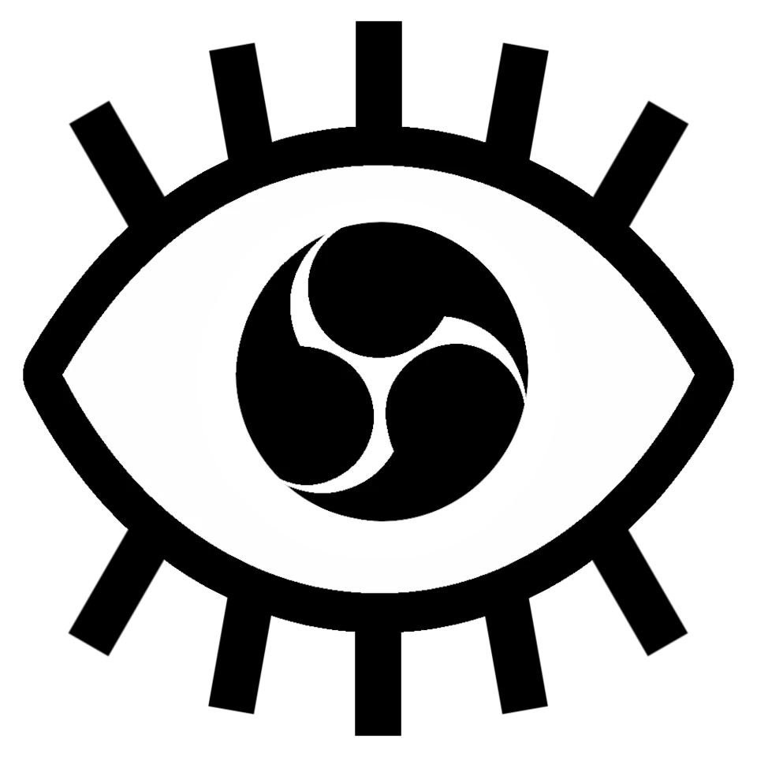

  

<h1 align="center">ⵙBSERV</h1>

<blockquote>
  
Control OBS' Websocket Server.

</blockquote>

> [!NOTE]  
> This project is currently held together with ducktape, LLMs, and dreams.
>> Do not use this for anything important / serious!

`I'm both amazed and horrified how far I was able to get via something in the ballpark of 'vibe programming'; Thar be dragons, and macros I def don't understand rn (if ever) lol`
